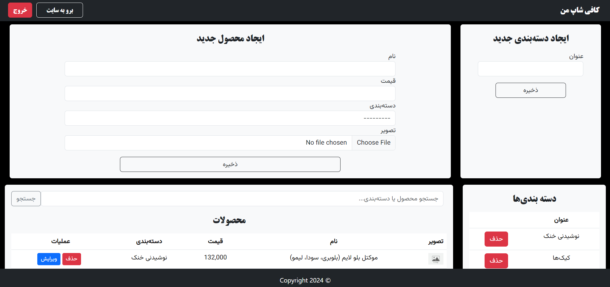
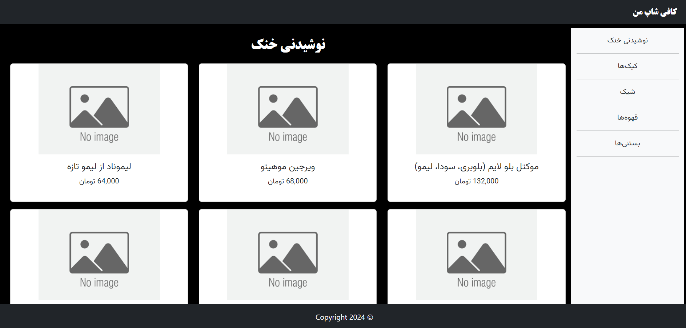

# Coffee Shop Menu Using Django

This project is a coffee shop menu developed using Django to review and improve my skills as a Django developer. It allows users to browse products and manage them through an admin panel.

## Key Features

- **Customized Admin Panel**: Manage products and categories with ease.
- **Product Management**: Add, update, and delete products directly from the admin panel.
- **User Roles**: Admin can manage the menu effectively.
- **Responsive Design**: List products effectively on various devices, ensuring a smooth user experience.

## Technical Details

- **Technologies Used:** Django, Python, HTML, CSS, Bootstrap
- **Database:** PostgreSQL

## Installation and Setup

### Requirements
Ensure you have Python and Django installed. PostgreSQL should also be configured.

### Installation Steps
1. Clone the repository.
2. Install dependencies using `pip install -r requirements.txt`.
3. Configure the PostgreSQL database in `settings.py`.
4. Run database migrations using `python manage.py migrate`.
5. Create a superuser with `python manage.py createsuperuser` to access the admin panel.
6. Start the development server with `python manage.py runserver`.

### Accessing the Admin Panel
Navigate to `http://127.0.0.1:8000/login/` in your web browser and log in with the superuser credentials.

## Screenshots

*Dashboard: Overview of the admin panel showing product management options.*

*Main Page: The landing page where users can see list of products.*

## Contributing
If you would like to contribute to this project, please fork the repository and submit a pull request.

## License
This project is licensed under the MIT License - see the LICENSE file for details.

